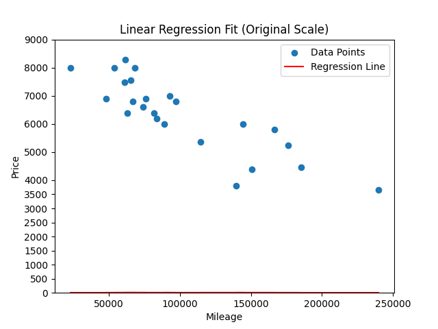

# Linear Regression Price Predictor

This project implements a simple **linear regression model** to estimate the price of a car based on its mileage. It consists of two main components:

- A **training script** (`linear_regresstion.py`) that reads a dataset, performs gradient descent to learn model parameters, and optionally displays an animated visualization of the training process.
- A **prediction script** (`prediction.py`) that loads the learned model and allows users to enter mileage values to get predicted prices.

---

##  Project Structure

- `linear_regresstion.py`: Trains the linear regression model using gradient descent on mileage vs price data, normalizes inputs, and saves the learned parameters.
- `prediction.py`: Loads the saved parameters and allows real-time price prediction via command-line input.
- `theta.json`: Output file containing the trained model parameters (`theta0`, `theta1`) and mileage normalization bounds.
- `data.csv`: The dataset containing car mileage and corresponding prices (assumed to have two columns: mileage and price).

---

##  Dependencies

Make sure the following Python packages are installed:

```bash

pip install numpy pandas matplotlib
```

## How to Run
1. Train the Model

Run the training script:
```bash
python linear_regresstion.py
```
This will:

   - Load data.csv

   - Normalize mileage data

   - Train the model using gradient descent

   - Save model parameters in theta.json

   - Display an animation showing the evolution of the regression line

2. Predict Prices

Once the model is trained, you can use the predictor:
```bash
python prediction.py
```
You'll be prompted to input mileage values, and it will return estimated prices based on the model.

## Visualization
The training script includes a matplotlib animation showing how the regression line fits the data over time using gradient descent. This is helpful for educational purposes and debugging.



##Notes
   -Ensure data.csv exists in the same directory and contains valid data.

   -The training script uses min-max normalization for stability during gradient descent.

   -The final parameters are unnormalized before saving to make prediction more interpretable.

